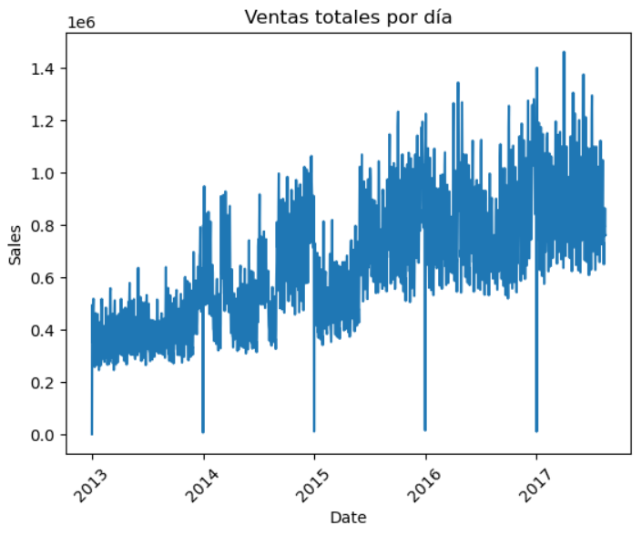
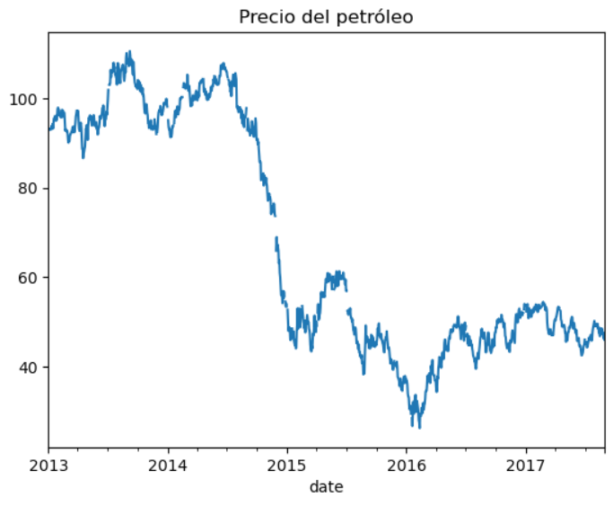
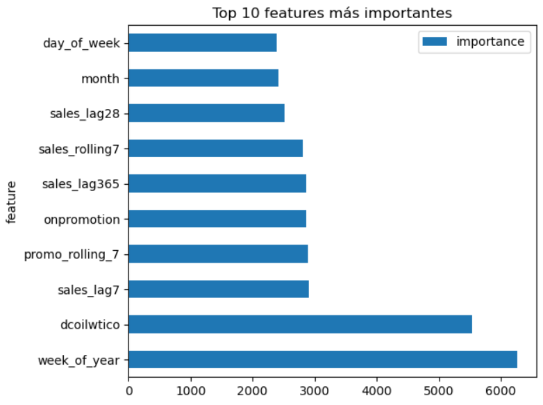

# 🛒 Sales Forecast — Corporación Favorita


## Planteamiento del problema
Las tiendas minoristas pierden ingresos y clientes cuando los estantes se vacían.
Este proyecto desarrolla un modelo de machine learning para predecir las ventas
de 1782 combinaciones de tienda y producto en 54 tiendas de Corporación
Favorita en Ecuador, con una proyección de 15 días.

## Contexto empresarial
La economía de Ecuador depende en gran medida de los ingresos petroleros. Cuando los precios del petróleo se desplomaron entre 2014 y 2016, el gasto de los consumidores se contrajo en todo el país. En abril de 2016, un terremoto de magnitud 7,8 perturbó aún más la economía. Estos choques externos impactaron directamente las ventas minoristas y hacen que la previsión precisa de la demanda sea especialmente difícil, pero también valiosa.

## Dataset
Source: [Kaggle — Store Sales Time Series Forecasting](https://www.kaggle.com/competitions/store-sales-time-series-forecasting)

| File | Description |
|------|-------------|
| train.csv | Sales history 2013–2017 |
| test.csv | Dates to predict |
| stores.csv | Store metadata (city, state, type, cluster) |
| oil.csv | Daily oil price |
| holidays_events.csv | Ecuador holidays and events |

## Metodología

### 1. Comprensión del negocio
Objetivo de predicción definido: ventas diarias por par (store, product family).
Métrica de evaluación identificada: RMSLE.

### 2. Análisis Exploratorio de Datos (AED)
Principales hallazgos:
- 📅 **Patrón semanal**: las ventas alcanzan su punto máximo los fines de semana
- 📆 **Patrón anual**: las ventas aumentan en julio y diciembre, y disminuyen en enero
- 🌍 **Eventos externos**: la caída del precio del petróleo de 2016 y el terremoto provocaron un estancamiento en las ventas
  a pesar del aumento de las promociones

<p align="center">
  
</p>

<p align="center">
  
</p>

### 3. Preparación de datos
- Se completaron los precios del petróleo faltantes (el mercado cierra los fines de semana)
- Se filtró la codificación de días festivos (`transferred == False`)
- Se fusionaron todos los conjuntos de datos por date and store_nbr

### 4. Feature engineering
| Feature | Type | Captures |
|---------|------|----------|
| sales_lag7/14/15/16/28 | Lag | Recent sales memory |
| sales_lag365 | Lag | Same period last year |
| sales_rolling7/14 | Rolling mean | Smoothed trend |
| promo_rolling_7 | Rolling mean | Promotion trend |
| is_weekend | Binary | Weekly seasonality |
| is_holiday | Binary | Holiday effect |
| week_of_year | Numeric | Annual seasonality |
| dcoilwtico | Numeric | Economic context |

### 5. Model selection
Elegimos **LightGBM** en lugar de SARIMA/Prophet porque:
- Entrena un modelo global para las 1782 series simultáneamente.
- Maneja variables externas (petróleo, días festivos) de forma nativa.
- Se adapta eficientemente a grandes conjuntos de datos tabulares.
- Aprende patrones comunes entre tiendas y familias de productos.

### 6. Model tuning
| Version | RMSLE val | Change |
|---------|-----------|--------|
| Baseline | 0.5221 | — |
| V2 (num_leaves=64) | 0.5061 | -0.0160 |
| V3 (+lag365) | 0.4850 | -0.0371 |

## Resultados
- **RMSLE de validación: 0.4850** (buena generalización)
- Las 3 características más importantes: week_of_year, dcoilwtico, sales_lag7
- Puntuación pública de Kaggle: 1.887

<p align="center">
  
</p>

## Cómo reproducir
```bash
git clone https://github.com/Rademirac/store-sales-forecast
cd store-sales-forecast
pip install -r requirements.txt
```
Descarga los datos de Kaggle y colócalos en la carpeta `/data`.
Luego ejecuta `/notebooks /notebook`

## Tech stack
`Python` `Pandas` `LightGBM` `Scikit-learn` `Matplotlib`